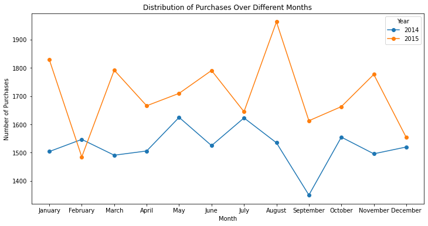

# Market Basket Analysis 
 
## Background
Market Basket Analysis (MBA), also known as association analysis or affinity analysis, is a data mining technique used in the field of retail and e-commerce to discover associations between products that are frequently purchased together. The analysis is based on the concept of a "market basket," which refers to a collection of items that a customer buys during a single shopping trip.
## About the Data
The dataset is a CSV file that contains one table, consisting of 38765 rows and 3 columns. The dataset can be found [here](Groceries_dataset.csv).
## Business Problems
1. Analyze the distribution of purchases over different dates or time periods.
2. Identify the most frequently purchased item descriptions.
3. Determine which items are commonly bought together (association analysis).

## Skills/ Concepts Applied
1. Data Preparation
2. Exploratory Data Analysis (EDA)
3. Market Basket Analysis
4. Visualization
5. Interpretation and Insights

## Data Transformation / Cleaning
1. I installed the pandas and MLXtend libraries into jupyter notebook.
```
pip install mlxtend 
pip install apyori
import numpy as np
import pandas as pd
import matplotlib.pyplot as plt
import seaborn as sns
from mlxtend.frequent_patterns import apriori, association_rules
```

2. I loaded the dataset and viewed the first 5 rows.

   ```
   groceries_data = pd.read_csv('groceries_dataset.csv')
   groceries_data.head()
   ```
 
 
 
3. I checked for null values
   ```
   groceries_data.isnull().sum().sort_values(ascending = False)
   ```
   There were no null values recorded


5. I converted the data type of the Date column from object to date
   ```
   groceries_data['date'] = pd.to_datetime(groceries_data['Date'])
   groceries_data.info()
   ```


## Insights and Visualization

1. I checked for the distribution of items
   ```
   item_Distribution = groceries_data.groupby(by = 
   'itemDescription').size().reset_index(name = 'Frequency').sort_values(by  
   = 'Frequency', ascending = False)
   ```


2. I created a bar chart showing the top ten sold items.
   Insight: The distribution of item purchases reveals that "Whole milk" is the top-selling 
   product, followed by "other vegetables" and "rolls/buns".
   ```
   # Extracting data for the bar chart
   item_Distribution = groceries_data.groupby(by = 
   'itemDescription').size().reset_index(name = 'Frequency').sort_values(by  
   = 'Frequency', ascending = False).head(10)
   bars = item_Distribution['itemDescription']
   height = item_Distribution['Frequency']
   x_pos = np.arange(len(bars))

   # Plotting the bar chart
   plt.figure(figsize = (16,9))
   plt.bar(x_pos, height,color = (0.2, 0.3, 0.5, 0.5))

   # Adding title and labels
   plt.title('Top 10 sold items')
   plt.xlabel('item names')
   plt.ylabel('number of quantity sold')
   plt.xticks(x_pos, bars)
   
   # Display the chart
   plt.show()
   ```


3. I created new columns for month and year, then grouped items sold by year and month. I then created a line chart showing purchases over different month and years.
```

# Assuming 'groceries_data' is your DataFrame with 'Date' column
# Ensure 'Date' is in datetime format
groceries_data['Date'] = pd.to_datetime(groceries_data['Date'])

# Create new columns for Month and Year
months_order = ['January', 'February', 'March', 'April', 'May', 'June', 'July', 'August', 'September', 'October', 'November', 'December']
groceries_data['Month'] = pd.Categorical(groceries_data['Date'].dt.strftime('%B'), categories=months_order, ordered=True)
groceries_data['Year'] = groceries_data['Date'].dt.year

# Group by Year and Month, and count the number of purchases
purchase_distribution = groceries_data.groupby(['Year', 'Month']).size().reset_index(name='Number_of_Purchases')

# Create a line chart with a separate line for each year
plt.figure(figsize=(12, 6))

for year in purchase_distribution['Year'].unique():
    year_data = purchase_distribution[purchase_distribution['Year'] == year]
    plt.plot(year_data['Month'], year_data['Number_of_Purchases'], label=str(year), marker='o', linestyle='-')

# Add labels and title
plt.xlabel('Month')
plt.ylabel('Number of Purchases')
plt.title('Distribution of Purchases Over Different Months')
plt.legend(title='Year', loc='upper right')

# Show the plot
plt.show()
```



Insight: The line chart depicting purchases over different months and years shows variations in consumer behavior. May 2014 and August 2015 recorded the highest purchases.


4. I selected 'Member_number' and 'itemDescription' columns from the DataFrame and sorting by 'Member_number' column in descending order. Then i stripped leading and trailing whitespaces from the 'itemDescription' column and displayed the result.
   
```
#Select 'Member_number' and 'itemDescription' columns from the DataFrame and sort by 'Member_number' column in descending order.
cust_level = groceries_data[['Member_number', 'itemDescription']].sort_values(by = 'Member_number', ascending =False)

#Srip leading and trailing whitespaces from the 'itemDescription' column and display the result
cust_level['itemDescription'] = cust_level['itemDescription'].str.strip()
cust_level
```


5. I Extracted the 'itemDescription' column and converted it to a list

```
# Extracting the 'itemDescription' column for each group and converting it to a list
transactions = [a[1]['itemDescription'].tolist() for a in list(cust_level.groupby(['Member_number']))]
```
6. I imported the apriori function from the apyori library

```
from apyori import apriori
```
I then defined the association rules using the apriori algorithm as follows:
* Transactions: The list of transactions to analyze (lists of item sets for each Member_number)
* Min_support: Minimum support threshold for an item set to be considered frequent
* Min_confidence: Minimum confidence threshold for generating association rules
* Min_lift: Minimum lift threshold for generating association rules
* Min_length: Minimum number of items in an item set to be considered for generating rules
 
```
rules = apriori(transactions=transactions, min_support=0.002, min_confidence=0.05, min_lift=3, min_length=2)

```
I Converted the generated association rules into a list for further analysis and inspection.
The variable 'results' now contains a list of association rules based on the specified parameters.

```
results = list(rules)
results
```

7. I defined a function named 'inspect' that takes 'results' as input

```
def inspect(results):
    # Extracting the left-hand side of each association rule
    lhs = [tuple(result[2][0][0])[0] for result in results]

    # Extracting the right-hand side of each association rule
    rhs = [tuple(result[2][0][1])[0] for result in results]

    # Extracting the support values of each association rule
    supports = [result[1] for result in results]

    # Extracting the confidence values of each association rule
    confidences = [result[2][0][2] for result in results]

    # Extracting the lift values of each association rule
    lifts = [result[2][0][3] for result in results]

    # Returning a list of tuples containing the extracted information
    return list(zip(lhs, rhs, supports, confidences, lifts))

```

I applied the 'inspect' function to the 'results' and converted the result into a DataFrame. The variable 'resultsindataframe' now contains a DataFrame with information about the association rules.

```
resultsindataframe = pd.DataFrame(inspect(results), columns=['Left hand side', 'Right hand side', 'Supports', 'Confidences', 'Lift'])

```
8. I Converted the 'Lift' column in the 'resultsindataframe' DataFrame to numeric type

```
resultsindataframe['Lift'] = pd.to_numeric(resultsindataframe['Lift'])

```

I selected the top 10 rows with the largest 'Lift' values in the DataFrame. I used 'nlargest' to retrieve the rows with the highest values in the specified column. The variable 'top_lifts' now contains the top 10 association rules with the highest 'Lift' values.

```
top_lifts = resultsindataframe.nlargest(n=10, columns='Lift')
```


Insight: The association analysis identifies item pairs frequently purchased together, as indicated by high lift values. The top 10 association rules with the highest lift values indicate strong relationships between certain items.

## Recomendations
1. Arrange high-selling items strategically within the store to maximize visibility.
Consider placing frequently associated items near each other to encourage complementary purchases.
2. Plan promotions and marketing campaigns around peak purchasing months, such as May and August.
Tailor promotions to align with changing consumer behaviors throughout the year.
3. Leverage customer-level analysis for personalized marketing efforts.
Send targeted promotions or recommendations based on individual customer preferences.
4. Create bundled promotions for items frequently purchased together.
Implement cross-selling strategies based on the identified association rules to enhance the customer shopping experience.
5. Regularly update the market basket analysis to adapt to changing consumer trends.
Stay agile in adjusting marketing strategies based on evolving customer preferences.
Implementing these recommendations can enhance the overall shopping experience, increase customer satisfaction, and potentially boost sales in the retail or e-commerce business.


   

   
   
   

   

